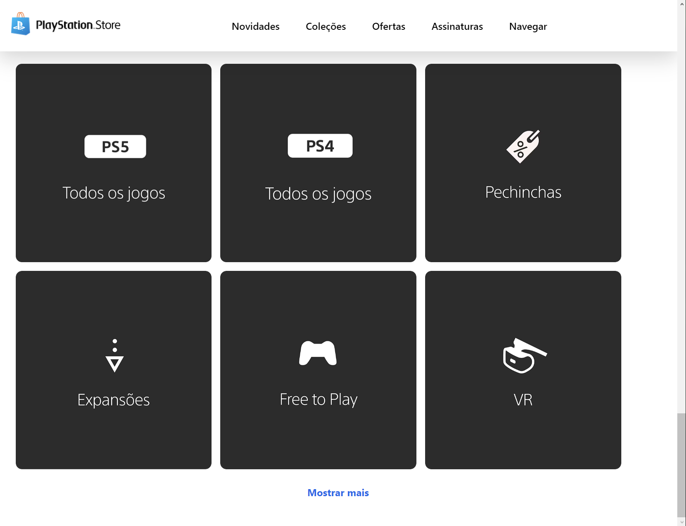

# 🎮 PlayStation Store Clone!
  clone of the playstation store interface for [DIO's](https://web.dio.me/) Angular class

  To view the project, just use "ng serve" in the terminal with Angular installed or you can check the images of the result below: teste

